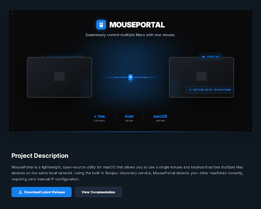

<p align="center">
  
</p>

# MousePortal

Seamlessly control multiple Macs with one mouse.

MousePortal is a native macOS utility that shares mouse and keyboard input across multiple Macs on the same local network. Move your cursor to the screen edge, and it jumps to the next machine — with motion-blur transitions, edge glow effects, and sub-millisecond event coalescing.

## Features

- **Edge detection with portal transitions** — cursor crosses screen boundaries with visual glow, motion trails, and snap flash effects
- **Physics Lab** — tune transition feel in real time: spring stiffness, blur intensity, portal friction, and transition mode (instant / elastic / smooth)
- **Settings sync** — physics config propagates between connected machines over the wire with debounced updates
- **Blur intensity controls** — drives glow spread (shadow radius 8–40pt), gradient diffusion, motion trail thickness, and portal snap flash duration
- **Multi-monitor support** — correctly detects and handles multiple displays on both sender and receiver
- **Bonjour auto-discovery** — finds other Macs on the network automatically, no manual IP configuration
- **Low latency** — 1ms coalesce interval, immediate-first-send pattern, raw pixel delta forwarding
- **Input suppression** — sender's local input is suppressed while forwarding; receiver suppresses its own trackpad
- **Menu bar app** — lives in the status bar with connection state indicator
- **Native macOS** — built entirely with Swift, CoreGraphics, Network.framework, and AppKit

## Requirements

- macOS 12.0 or later
- Swift 5.10+
- Accessibility permissions (prompted on first run)

## Quick Start

### Build & Run

```bash
swift build
```

Launch the app — it appears in the menu bar. Click the icon to open the pairing popover, discover nearby Macs, and connect.

**Note:** You'll be prompted for Accessibility permissions on first run. Grant them in System Settings > Privacy & Security > Accessibility.

### Physics Lab

Once connected, open the Physics Lab from the popover to tune transition behavior:

| Parameter | Effect |
|---|---|
| **Mode** | instant (minimal visual), elastic (edge tug), smooth (motion blur trail) |
| **Spring Stiffness** | Controls elastic resistance at the edge |
| **Blur Intensity** | Glow spread, gradient diffusion, trail thickness, flash duration |
| **Portal Friction** | Dwell time before edge crossing triggers |

Settings sync across both devices automatically.

## Architecture

```
Sources/
├── InputShareShared/      # Protocol models, codecs, message types
├── InputShareTransport/   # Network.framework framing
├── InputShareCapture/     # CGEventTap capture + screen geometry
├── InputShareInjection/   # CGEventPost injection
├── InputShareEdge/        # Edge detection + triggers
├── InputShareDiscovery/   # Bonjour browsing + advertising
├── MouseApp/              # SwiftUI menu bar app, Physics Lab, edge glow
└── InputShareCLI/         # Command-line interface
```

### Protocol

Length-prefixed JSON messages over TCP. Message types: `hello`, `activate`, `activated`, `deactivate`, `deactivated`, `inputEvent`, `pairRequest`, `pairAccept`, `physicsConfig`.

### Key Design Decisions

- **Coordinates:** Raw pixel deltas for mouse movement (no normalization loss), normalized Y for edge crossing handoff
- **Coalescing:** First event sent immediately, subsequent burst events accumulated and flushed at 1ms intervals
- **Edge glow:** Full-height NSPanel overlay with SwiftUI gradient, breathing animation, and velocity-driven width
- **Config sync:** Debounced at 0.3s to avoid spamming during slider drag, sent on connection ready for reconnect persistence

## Development

```bash
swift build    # Build all targets
swift test     # Run tests
```

## License

[Add license information]
